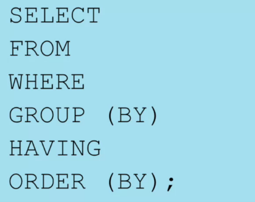
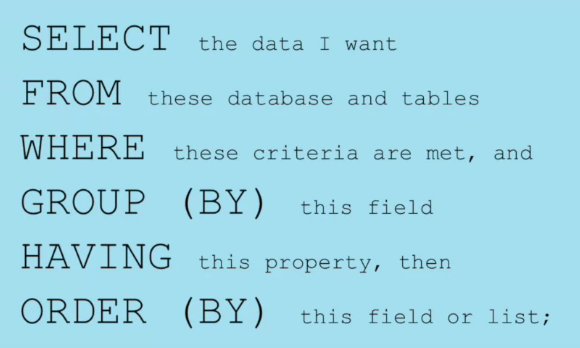

# Week 2

## Queries

> Query:
SQL code that describes the data you desire and the format in which you want it

* All queries start with a verb SELECT followed by clauses that identify the data and the database you want to work with and the format.



* SELECT and from and required
* You must end your queries with ;

## Syntax

* Recommended syntax is to write each keyword along with the caracthers that follow them in each line as :



## Other Keywords/Commands

* SHOW

Examples:
```SQL
SHOW tables
SHOW columns FROM $table$
SHOW columns FROM $table$ FROM $database$
SHOW columns FROM $databasename.tablename$
```

* DESCRIBE

> Gets a detailed description of the table

<table>
    <tbody>
        <tr>
            <th>Field</th>
            <th>Type</th>
            <th>Null</th>
            <th>Key</th>
            <th>Default</th>
            <th>Extra</th>
        </tr>
        <tr>
            <td>created_at</td>
            <td>datetime</td>
            <td>NO</td>
            <td></td>
            <td>None</td>
            <td></td>
        </tr>
        <tr>
            <td>updated_at</td>
            <td>datetime</td>
            <td>NO</td>
            <td></td>
            <td>None</td>
            <td></td>
        </tr>
        <tr>
            <td>user_guid</td>
            <td>varchar(60)</td>
            <td>YES</td>
            <td>MUL</td>
            <td>None</td>
            <td></td>
        </tr>
        <tr>
            <td>dog_guid</td>
            <td>varchar(60)</td>
            <td>YES</td>
            <td>MUL</td>
            <td>None</td>
            <td></td>
        </tr>
        <tr>
            <td>test_name</td>
            <td>varchar(60)</td>
            <td>YES</td>
            <td></td>
            <td>None</td>
            <td></td>
        </tr>
        <tr>
            <td>subcategory_name</td>
            <td>varchar(60)</td>
            <td>YES</td>
            <td></td>
            <td>None</td>
            <td></td>
        </tr>
    </tbody>
</table>

* SQL syntax and keywords are case insensitive. I recommend that you always enter SQL keywords in upper case and table or column names in either lower case or their native format to make it easy to read and troubleshoot your code, but it is not a requirement to do so. Table or column names are often case insensitive as well, but defaults may vary across database platforms so it's always a good idea to check.
* Table or column names with spaces in them need to be surrounded by quotation marks in SQL. MySQL accepts both double and single quotation marks, but some database systems only accept single quotation marks. In all database systems, if a table or column name contains an SQL keyword, the name must be enclosed in backticks instead of quotation marks.

>    'the marks that surrounds this phrase are single quotation marks'
    "the marks that surrounds this phrase are double quotation marks"
    \`the marks that surround this phrase are backticks\`


* The semi-colon at the end of a query is only required when you have multiple separate queries saved in the same text file or editor. That said, I recommend that you make it a habit to always include a semi-colon at the end of your queries. 

* LIMIT

Limitates the number of rows selected

* OFFSET

Give a offset to the SELECT clause

```SQL
SELECT breed
FROM dogs LIMIT 10 OFFSET 5;
```

or you could just do:

```SQL
SELECT breed
FROM dogs LIMIT 5,10;
```